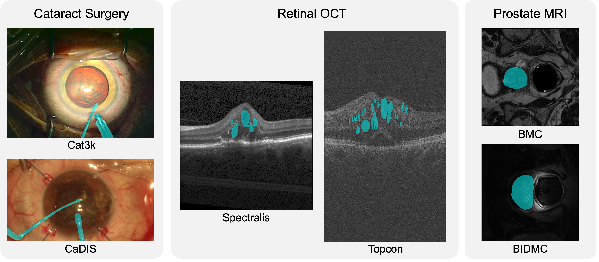
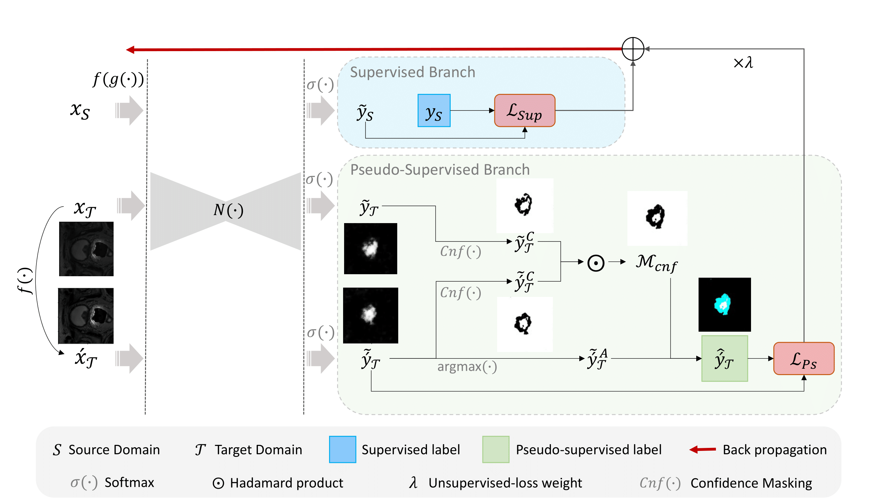
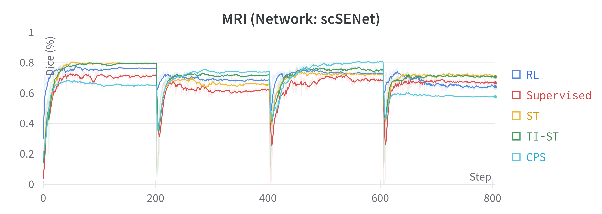
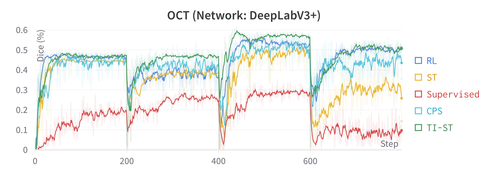
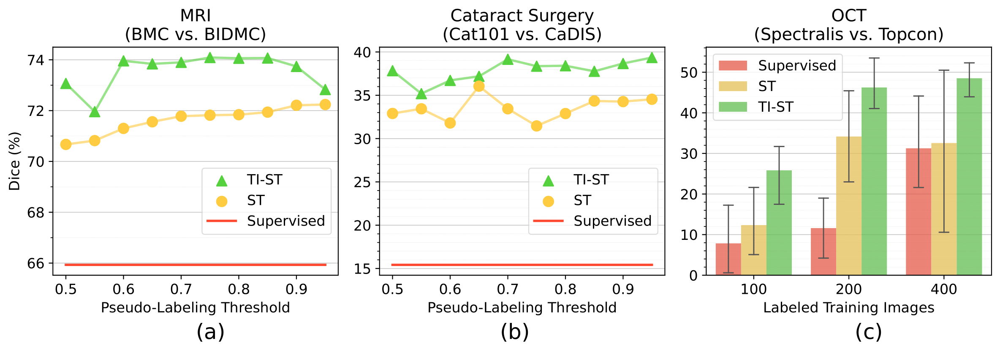
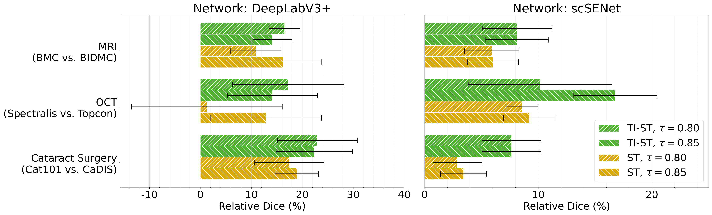
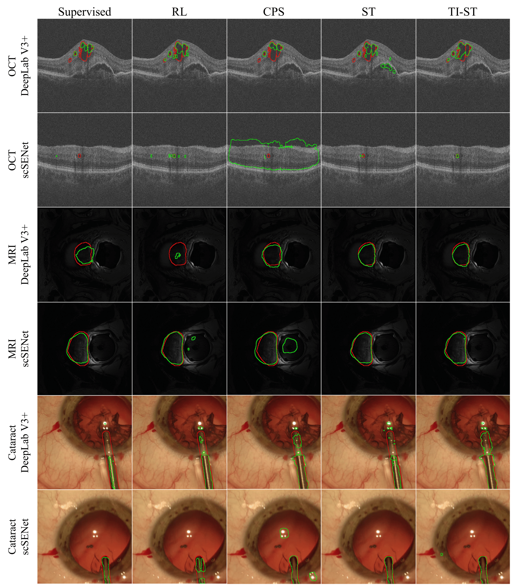
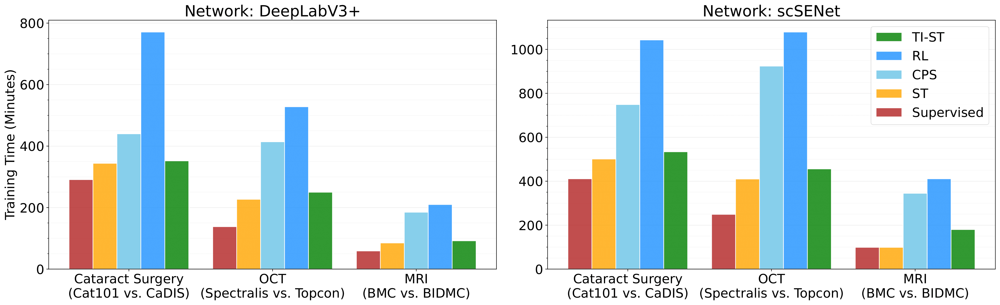

# Transformation-Invariant-Self-Training

This repository provides the official PyTorch implementation of Transformation-Invariant Self-Training (Domain Adaptation for Medical Image Segmentation using Transformation-Invariant Self-Training).

TI-ST is initially proposed for semantic segmentation in the medical domain but can be adopted for any general-purpose image segmentation problem.

This method uses transformation-invariant highly-confident predictions in the target dataset by considering an ensemble of high-confidence predictions from transformed versions of identical inputs.

---

**Problem of domain shift in medical image segmentation.**



---

**Overview of the proposed unsupervised domain adaptation framework.**

Ignored pseudo-labels during unsupervised loss computation are shown in turquoise.



---

**Four-fold training curves corresponding to TI-ST and the main alternative methods.**




---

**Ablation studies on the pseudo-labeling threshold and size of the labeled dataset.**



---

**Ablation study on the performance stability of TI-ST vs. ST across the different experimental segmentation tasks.**



---

**Qualitative comparisons between the performance of TI-ST and four existing methods.**



---

**Comparisons between the training time of the proposed TI-ST and the main alternatives.**



---


## Citation
If you use AdaptNet for your research, please cite our paper:

```
@inproceedings{ghamsarian2023TI-ST,
  title={Domain Adaptation for Medical Image Segmentation using Transformation-Invariant Self-Training},
  author={Ghamsarian, Negin and Gamazo Tejero, Javier and Márquez Neila, Pablo and Wolf, Sebastian and Zinkernagel, Martin and Schoeffmann, Klaus and Sznitman, Raphael},
  booktitle={International Conference on Medical Image Computing and Computer-Assisted Intervention},
  pages={},
  year={2023},
  organization={Springer}
}
```

## Acknowledgments

This work was funded by Haag-Streit Switzerland.
